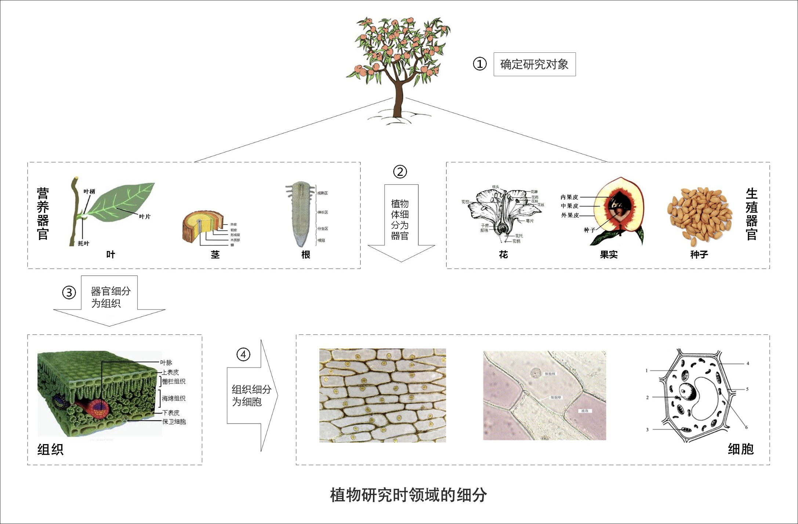

# 02 | 领域、子域、核心域、通用域和支撑域：傻傻分不清？

DDD 的知识体系提出了很多的名词，像：领域、子域、核心域、通用域、支撑域、限界上下文、聚合、聚合根、实体、值对象等等，非常多。这些名词，都是关键概念，但它们实在有些晦涩难懂，可能导致你还没开始实践 DDD 就打起了退堂鼓。因此，在基础篇中，我希望能带着你一起做好实践前的准备工作。

除此之外，我想说的是，这些名词在你的微服务设计和开发过程中不一定都用得上，但它可以帮你理解 DDD 的核心设计思想和理念。而这些思想和理念，在 IT 战略设计、业务建模和微服务设计中都是可以借鉴的。

那么，从这讲开始，我就会围绕以上这些 DDD 关键概念进行讲解，帮助你彻底理清它们与微服务的关系，了解它们在微服务设计中的作用。今天我们重点了解 DDD 的领域、子域、核心域、通用域和支撑域等重要概念。

## 如何理解领域和子域？

我们先看一下汉语词典中对领域的解释：“领域是从事一种专门活动或事业的范围、部类或部门。”百度百科对领域的解释：“领域具体指一种特定的范围或区域。”

两个解释有一个共同点——范围。对了！领域就是用来确定范围的，范围即边界，这也是 DDD 在设计中不断强调边界的原因。

在研究和解决业务问题时，DDD 会按照一定的规则将业务领域进行细分，当领域细分到一定的程度后，DDD 会将问题范围限定在特定的边界内，在这个边界内建立领域模型，进而用代码实现该领域模型，解决相应的业务问题。简言之，DDD 的领域就是这个边界内要解决的业务问题域。

既然领域是用来限定业务边界和范围的，那么就会有大小之分，领域越大，业务范围就越大，反之则相反。

领域可以进一步划分为子领域。我们把划分出来的多个子领域称为子域，每个子域对应一个更小的问题域或更小的业务范围。

我们知道，DDD 是一种处理高度复杂领域的设计思想，它试图分离技术实现的复杂度。那么面对错综复杂的业务领域，DDD 是如何使业务从复杂变得简单，更容易让人理解，技术实现更容易呢？

其实很好理解，DDD 的研究方法与自然科学的研究方法类似。当人们在自然科学研究中遇到复杂问题时，通常的做法就是将问题一步一步地细分，再针对细分出来的问题域，逐个深入研究，探索和建立所有子域的知识体系。当所有问题子域完成研究时，我们就建立了全部领域的完整知识体系了。

我们来看一下上面这张图。这个例子是在讲如何给桃树建立一个完整的生物学知识体系。初中生物课其实早就告诉我们研究方法了。它的研究过程是这样的。

第一步：确定研究对象，即研究领域，这里是一棵桃树。

第二步：对研究对象进行细分，将桃树细分为器官，器官又分为营养器官和生殖器官两种。其中营养器官包括根、茎和叶，生殖器官包括花、果实和种子。桃树的知识体系是我们已经确定要研究的问题域，对应 DDD 的领域。根、茎、叶、花、果实和种子等器官则是细分后的问题子域。这个过程就是 DDD 将领域细分为多个子域的过程。

第三步：对器官进行细分，将器官细分为组织。比如，叶子器官可细分为保护组织、营养组织和输导组织等。这个过程就是 DDD 将子域进一步细分为多个子域的过程。

第四步：对组织进行细分，将组织细分为细胞，细胞成为我们研究的最小单元。细胞之间的细胞壁确定了单元的边界，也确定了研究的最小边界。

这里先剧透一点聚合、聚合根、实体以及值对象的内容，我还会在 [第 04 讲] 和 [第 05 讲] 中详细讲解。

我们知道细胞核、线粒体、细胞膜等物质共同构成细胞，这些物质一起协作让细胞具有这类细胞特定的生物功能。在这里你可以把细胞理解为 DDD 的聚合，细胞内的这些物质就可以理解为聚合里面的聚合根、实体以及值对象等，在聚合内这些实体一起协作完成特定的业务功能。这个过程类似 DDD 设计时，确定微服务内功能要素和边界的过程。

这里总结一下，就是说每一个细分的领域都会有一个知识体系，也就是 DDD 的领域模型。在所有子域的研究完成后，我们就建立了全域的知识体系了，也就建立了全域的领域模型。

上面我们用自然科学研究的方法，说明了领域可以通过细分为子域的方法，来降低研究的复杂度。现在我们把这个话题再切换到业务领域，对比验证下，二者的细分过程是否是一致的。这里以我从事的保险行业为例。

保险是个比较大的领域，很早以前的保险核心系统把所有的功能都放在一个系统里来实现，这个系统就是我们常说的单体系统。后来单体系统开始无法适应保险业务的发展，因此保险公司开始了中台转型，引入分布式微服务架构来替换原来的单体系统。而分布式微服务架构就需要划分业务领域边界，建立领域模型，并实现微服务落地了。

为实现保险领域建模和微服务建设，我们可以根据业务关联度以及流程边界将保险领域细分为：承保、收付、再保以及理赔等子域，而承保子域还可以继续细分为投保、保全（寿险）、批改（财险）等子子域。

在投保这个限界上下文内可以建立投保的领域模型，投保的领域模型最后映射到系统就是投保微服务。这就是一个保险领域的细分和微服务的建设过程。

那么你可能会说，我不是保险行业的人，我怎么理解这个过程呢？我认为，不同行业的业务模型可能会不一样，但领域建模和微服务建设的过程和方法基本类似，其核心思想就是将问题域逐步分解，降低业务理解和系统实现的复杂度。

## 如何理解核心域、通用域和支撑域？

在领域不断划分的过程中，领域会细分为不同的子域，子域可以根据自身重要性和功能属性划分为三类子域，它们分别是：核心域、通用域和支撑域。

决定产品和公司核心竞争力的子域是核心域，**它是业务成功的主要因素和公司的核心竞争力。**没有太多个性化的诉求，**同时被多个子域使用的通用功能子域是通用域。**还有一种功能子域是必需的，**但既不包含决定产品和公司核心竞争力的功能，也不包含通用功能的子域，它就是支撑域。**

这三类子域相较之下，核心域是最重要的，我们下面讲目的的时候还会以核心域为例详细介绍。通用域和支撑域如果对应到企业系统，举例来说的话，通用域则是你需要用到的通用系统，比如认证、权限等等，这类应用很容易买到，没有企业特点限制，不需要做太多的定制化。而支撑域则具有企业特性，但不具有通用性，例如数据代码类的数据字典等系统。

### 那为什么要划分核心域、通用域和支撑域，主要目的是什么呢？

还是拿上图的桃树来说吧。我们将桃树细分为了根、茎、叶、花、果实和种子等六个子域，那桃树是否有核心域？有的话，到底哪个是核心域呢？

不同的人对桃树的理解是不同的。如果这棵桃树生长在公园里，在园丁的眼里，他喜欢的是“人面桃花相映红”的阳春三月，这时花就是桃树的核心域。但如果这棵桃树生长在果园里，对果农来说，他则是希望在丰收的季节收获硕果累累的桃子，这时果实就是桃树的核心域。

在不同的场景下，不同的人对桃树核心域的理解是不同的，因此对桃树的处理方式也会不一样。园丁更关注桃树花期的营养，而果农则更关注桃树落果期的营养，有时为了保证果实的营养供给，还会裁剪掉疯长的茎和叶（通用域或支撑域）。

同样的道理，公司在 IT 系统建设过程中，由于预算和资源有限，对不同类型的子域应有不同的关注度和资源投入策略，记住好钢要用在刀刃上。

很多公司的业务，表面看上去相似，但商业模式和战略方向是存在很大差异的，因此公司的关注点会不一样，在划分核心域、通用域和支撑域时，其结果也会出现非常大的差异。

比如同样都是电商平台的淘宝、天猫、京东和苏宁易购，他们的商业模式是不同的。淘宝是 C2C 网站，个人卖家对个人买家，而天猫、京东和苏宁易购则是 B2C 网站，是公司卖家对个人买家。即便是苏宁易购与京东都是 B2C 的模式，他们的商业模式也是不一样的，苏宁易购是典型的传统线下卖场转型成为电商，京东则是直营加部分平台模式。

商业模式的不同会导致核心域划分结果的不同。有的公司核心域可能在客户服务，有的可能在产品质量，有的可能在物流。在公司领域细分、建立领域模型和系统建设时，我们就要结合公司战略重点和商业模式，找到核心域了，且重点关注核心域。

如果你的公司刚好有意向转型微服务架构的话，我建议你和你的技术团队要将核心域的建设排在首位，最好是有绝对的掌控能力和自主研发能力，如果资源实在有限的话，可以在支撑域或者通用域上想想办法，暂时采用外购的方式也未尝不可。

## 总结

领域的核心思想就是将问题域逐级细分，来降低业务理解和系统实现的复杂度。通过领域细分，逐步缩小微服务需要解决的问题域，构建合适的领域模型，而领域模型映射成系统就是微服务了。

核心域、支撑域和通用域的主要目标是：通过领域划分，区分不同子域在公司内的不同功能属性和重要性，从而公司可对不同子域采取不同的资源投入和建设策略，其关注度也会不一样。

## QA

您好，以我公司新启动的业务线“平安社区”为例，以安防设备为集成基础。安防设备和物联网平台却都是市场成熟厂家提供，划分为通用域；平安社区业务场景如人车双验、异常人员识别等个性化应用属于业务线的支撑域；人员数据、行为数据富有长期价值，这些视为核心域。如果未来在某个细分场景做到了领先且拥有市场壁垒，这样的业务也可能会从支撑域调整为核心域。
所以，核心域、通用域、支撑域的划分本质是公司战略方向的体现，DDD是从战略到战术角度来进行架构设计的方法。

老师你好，关于问题空间和解决方案空间一直不是很理解，子域的划分属于问题空间，而限界上下文则属于解决方案空间。
但是这个所谓的问题空间和解决方案空间到底是啥？对于我们分析问题而言为何要划分这两种空间？

作者回复: 你可以这么理解。问题空间的划分也就是子域的划分过程，实际上还是一个业务粗分过程，因为领域太大的话，你不方便对它进行分析和设计。
只有问题空间小到一定程度后，你才可以熟悉的定义解决方案空间，在这个比较小的空间内进行事件风暴，找出领域对象，构建聚合，划分限界上下文，建立领域模型，再进行微服务的设计，也就是一个解决方案的形成过程。

作者回复: 个人感觉区分支撑域和通用域的意义不是太大。
挖掘出核心域是有意义的，主要是明确战略重点，将重要的核心资源投入到核心域。
支撑域和通用域在战略上基本上是同级的，有时候两者会转换。

虽然DDD没有明确说明子域和限界上下文的关系。我个人认为，子域的划分是一种比较粗的领域边界的划分，它不考虑子域内的领域对象、对象之间的关系和结构。子域的划分往往按照业务阶段或者功能模块边界进行粗分，其目的就是为了让你能够在一个相对较小的问题空间内，比较方便的用事件风暴来梳理业务场景。而限界上下文本质上也是子域，限界上下文是在明确的子域内，用事件风暴划分出来的。它体现的是一种详细的设计过程。这个过程设计出了领域模型，明确了领域对象以及领域对象的依赖等关系，有了领域模型，你就可以直接进行微服务设计了。
聚合是最小的业务单元，也是可以独立作为微服务的。

在DDD中包括问题域和解决方案域两个不同的维度。问题域主要从业务视角来考虑，完成从领域到子域的分解，而解决方案域则主要从技术实现的角度，通过划分限界上下文和采用DDD战术设计完成微服务拆分和落地。“子域”和“限界上下文”这两个概念分别从不同的视角，构建起了DDD 处理业务复杂度的根基。
个人认为“子域”和“限界上下文”在大多数情况下是一对一或者一对多的映射关系。从实践角度，我们可以这样理解，我们不妨将业务领域的分解拆分为两个阶段：从领域到子域的粗粒度的分解和从子域到限界上下文的技术实现级的分解。有时候企业的业务领域非常庞大，不太方便用事件风暴对整个领域构建领域模型。所以在领域建模之前，我们先根据业务流程边界或者功能集合等要素，将庞大的领域分解成若干个大小合适的子域，然后根据子域属性划分为核心子域、通用子域和支撑子域。当领域分解到足够小后，我们就可以在这些子域内开展事件风暴，划分限界上下文完成领域建模。
在对不同属性子域构建领域模型时，我们可能会有不同的关注点，比如在通用子域构建领域模型时，我们会更多的关注领域模型的抽象和标准化，以便实现企业级复用，这种设计方法与中台的业务建模方法是一致的。当然，如果你的领域足够小的话，我们就没必要进行从领域到子域的分解和属性归类了，你可以直接开展事件风暴，直接划分限界上下文，完成领域建模。按照这种分解方式，如果子域和限界上下文边界刚好一致，那它们就是一对一的关系，而如果在一个子域内还可以划分为多个限界上下文，那我们最终得到的就是一对多的映射关系。需要注意的是，有些通用子域构建出来的领域模型往往会因为复用的需要，可能会跨多个不同的其他业务子域。
限界上下文本质上就是子域，只不过它会更多的考虑领域对象的语义边界和技术实现细节。限界上下文的划分体现的是一种更为详细的设计过程，这个过程划分了业务的上下文语义边界，完成了领域模型，明确了领域对象以及领域对象之间的依赖关系等。我们依据限界上下文和领域模型就可以完成微服务设计和落地了。

领域划分为子域需要根据公司的业务以及依赖领域专家的知识和经验。如果领域专家的经验不足，通常需要如何应对呢？另外领域专家之间达不成一致意见，陷入无止境的争论，这种情况下有如何应对？

作者回复: 1、领域专家经验不足就需要团队整体来讨论和决策，这个在很多新的创业的系统建设过程中应该很常见。领域模型也是需要多次迭代才能变得成熟和稳定。多做几次迭代才能摸索出完美的领域模型。
2、这个需要团队有相应的沟通规则。

请问老师，微服务架构物理上是否必须用分布式架构来实施？我理解采用微服务架构是系统具备了以微服务为单位独立部署的能力，但完全还是可以在同一台物理设备上部署。理解对么？

作者回复: 微服务本身就是一种分布式架构的实现方式。微服务要发挥它的价值，最好能够在云平台上来做，利用容器以及DevOps等技术。实际上微服务也是可以跟集中式架构系统一样，部署在物理机上的，但这样失去了它的价值。系统拆的过细，集成成本高，还增加了你的运维压力。

